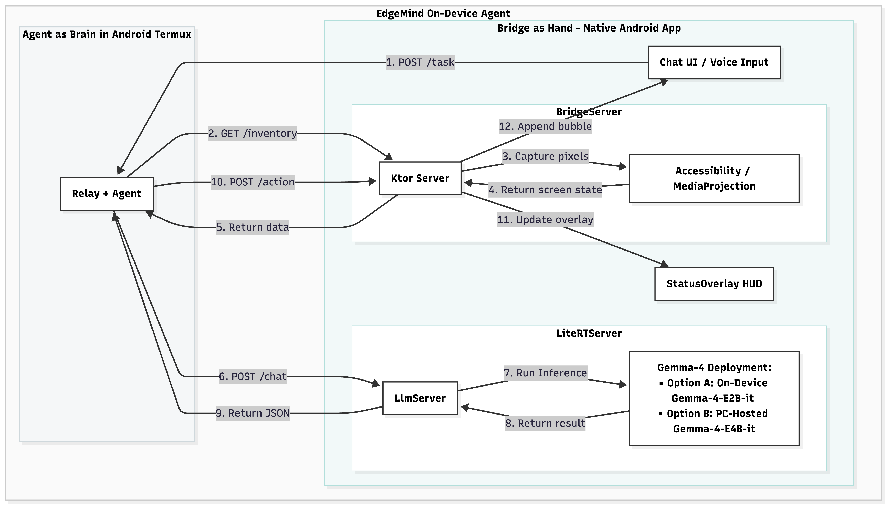

# AEVA2: Android Edge Vision Agent

AEVA2 is a unified framework for on-device Android automation, combining a low-latency communication bridge with an intelligent agent powered by vision-language models.

## Project Structure

- `bridge-android/`: The Android-side relay and bridge infrastructure. Handles communication between the device and the agent.
- `termux-agent/`: The intelligent agent that runs directly inside Termux on your phone to control the Android device via the bridge. **Termux must be pre-installed** on your device (see Prerequisites).



## Prerequisites

### Hardware Requirements

- **RAM**: Your Android device **must have at least 8GB of RAM**. The on-device AI models (LiteRT-LM) require significant memory to load and run efficiently. Devices with less than 8GB will likely crash or fail to load the model.

### Software Prerequisites [Ask gemini/claude to install for you]

- **Android Device**: With Developer Options and USB Debugging enabled.
- **Termux**: **CRITICAL**. You must install Termux to run the agent on your phone.
  - **DO NOT** use the Google Play Store version (it is outdated and broken).
  - **Install from F-Droid**: Ask Claude/Gemini to download the F-Droid APK from [f-droid.org](https://f-droid.org/), search for "Termux", and install it. This is the official, open-source, and up-to-date version. Ask Claude/Gemini to install ssh-server for you on termux..
- **ADB**: Installed on your host machine.
- **Java 21 (OpenJDK)**: Required for compiling the bridge.
- **Python 3.10+**: Required for the agent and relay scripts.

## Quick Start: Launching Both Components

To launch the full AEVA2 stack, follow these steps:

### 1. Install the Android Bridge APP [Ask gemini/claude to install for you]

Connect your andriod device to your host machine via USB. Enable USB debugging. Navigate to the `bridge-android` directory. Ask Claude/Gemini to build the project, and deploy it to your device:

```bash
cd bridge-android
./scripts/build_local.sh && ./scripts/deploy_local.sh
```

Note: Again I am using a jump host to connect to my android here, configured in these scripts, but I asked gemini to write a script for any direct connection from your host machine to the device.

```bash
cd bridge-android
./scripts/build_local.sh && ./scripts/deploy_direct.sh
```

### 1.5. What you have to do manually by yourself:

APK will be installed on your android device, then you need to open it and go to settings on top right corner to enable accessibility service and status overlay. Allow the notification permission and screen recording permission for the APP to control other apps. [These are the required permissions you need to set manually, and gemini/claude cannot do for you.]

The first time you download the app, you need to download the model gemma-4-E2B-it.litertlm in the settings page. It takes a few Gigabytes of storage.

### 2. Launch the Termux Agent Server

In a separate terminal, navigate to the `termux-agent` directory and start the server. You don't have to open Termux App, as the script will open it for you.

```bash
cd termux-agent
./scripts/run_termux_server.sh
```

Note: Again I am using a jump host to connect to my android here, configured in these scripts, but I asked gemini to write a script for any direct connection from your host machine to the device.

```bash
cd termux-agent
./scripts/run_termux_server_direct.sh
```

### 3. Verification

Check the terminal outputs. The bridge should be deployed with green marks on its setting page, which means LLM inference server is on, for the agent brain to access, and the bridge gets enough permissions from you to see the screen and control the device.

Also the Termux server should be listening for connections. You may see an overlay HUD which will show the progress of the agent. Then you can play with the chat UI with text or voice. Use /task to trigger the agent, otherwise plain text will directly go to the model like normal chat. Use /stop to stop the agent.

Start with simply queries.
Sample queries to test the agent:
See termux-agent/CASES_ENGLISH.md for queries in English.

### 4. Debugging

ADB is your friend. We support ADB mode and bridge mode. ADB is for debugging.

Check termux-agent/run.ipynb for easy debugging.

To use LLM server from your laptop rather than phone, simply change the option in humanoid_agent.py, and start_agent_temux.sh script. [Ask Claude/Gemini to do it for you.]

### 5. Benchmark and Comparison:

For detailed performance metrics, 100-scenario benchmark results, and UI latency optimizations, please check out:

- [termux-agent/BENCHMARK_OPTIMIZATION.md](termux-agent/BENCHMARK_OPTIMIZATION.md) (100-scenario benchmark, UI latency optimizations, how to get gemma to beat it)
- [termux-agent/PROFILING.md](termux-agent/PROFILING.md) (Detailed phase timings and Text vs Image token comparison)

## Detailed Information for Developer:

For developers and curious users, here is what happens when you run those commands.

### 1. The Build Process (`build_local.sh`)

When you run the build script, your computer acts as a **factory**:

- **Dependencies**: You need **JDK 21** (Java) and the **Android SDK**. Java runs the compiler, and the SDK provides the "blueprints" for Android apps.
- **Gradle**: We use a tool called Gradle to fetch libraries and compile the Kotlin code into an **APK** (Android Package) file.
- **Result**: A file named `app-debug.apk` is created. This is the "Bridge" that will live on your phone.

### 2. The Deployment (`deploy_local.sh`)

This script handles the "delivery" of the app to your device:

- **The Jump Host**: Often, your development machine isn't the one physically connected to the phone. We use `scp` to send the APK to a "Jump Host" (a machine named `win` in our scripts) that has the USB connection.
- **ADB (Android Debug Bridge)**: This is a critical tool used for **installing the APK** and for **debugging**. it communicates over USB to the phone, allowing the computer to manage the device, install packages, and inspect logs.
- **Smart Installation**: We use `adb install -r -t -g`.
  - `-r`: Replaces the old version but keeps your settings.
  - `-t`: Allows "Test" apps to be installed.
  - `-g`: **Crucial!** It automatically grants all permissions (Camera, Files, Accessibility) so you don't have to click "Allow" dozens of times on the phone.

### 3. The Tunnels (The Secret to Connectivity) for Debugging

To communicate across different networks or bypass firewalls, the system uses two main approaches:

- **Tailscale (Production/Remote)**: For reliable connectivity across different locations, we recommend using **Tailscale**. It creates a secure Mesh VPN, allowing your phone and computer to talk as if they were on the same local network, regardless of physical location.
- **ADB Tunnels (Debugging Only)**: When connected via USB, we use ADB tunnels (`forward` and `reverse`). This is primarily for **debugging** and local development.
  - **ADB Forward**: Allows your computer to "call" the phone (e.g., to ask for a screenshot).
  - **ADB Reverse**: Allows the phone to "call" your computer (e.g., to send events).

### 4. Debugging & Remote Interaction

If you want to see what's happening or use more powerful models from your computer:

- **Screen Mirroring**: Use tools like **scrcpy** to mirror the phone's screen to your desktop in real-time.
- **Remote Models**: While the phone can run models locally, you can also connect to powerful models running on your computer via **Telnet**, **SSH**, or **ADB tunnels**.
- **The Agent Server (`run_termux_server.sh`)**:
  - Deploys Python scripts into the **Termux** environment on your phone.
  - Starts a **Daemon** (background worker) that stays alive even if you close the terminal.
  - **On-Device AI**: Optionally loads a machine learning model (LiteRT-LM) onto the phone's GPU for 100% offline intelligence.

## Summary of Dependencies

To be a developer on this project, you need:

1. **Java 21 (OpenJDK)**: For compiling the Android code.
2. **Android SDK & Build Tools**: For packaging the APK.
3. **ADB (Android Debug Bridge)**: For USB communication.
4. **Python 3.10+**: For running the Agent and Relay scripts.
5. **SSH & SCP**: For remote deployment if your phone is connected to a different machine.

## License

See the `LICENSE` file for details.
